  

<a href="https://gitcolors.vercel.app" target="_blank" rel="noopener">
  <picture>
    <source srcset="https://gitcolors.vercel.app/api/svg?username=dooneygit&color=ff7472&theme=dark&mode=levels&preset=none&animate=true&emptyColor=neutral" media="(prefers-color-scheme: dark)" />
    <source srcset="https://gitcolors.vercel.app/api/svg?username=dooneygit&color=ff7472&theme=light&mode=levels&preset=none&animate=true&emptyColor=neutral" media="(prefers-color-scheme: light)" />
    
  </picture>
</a>

<table>
<tr>
<td>

tech stack wow

| Languages | Frameworks | Technologies |
|---|---|---|
|  |  |  |
|  |  |  |
|  |  |  |
|  |  |  |
|  |  |  |
|  |  |  |

</td>
<td>

</td>
</tr>
</table>

 

  

